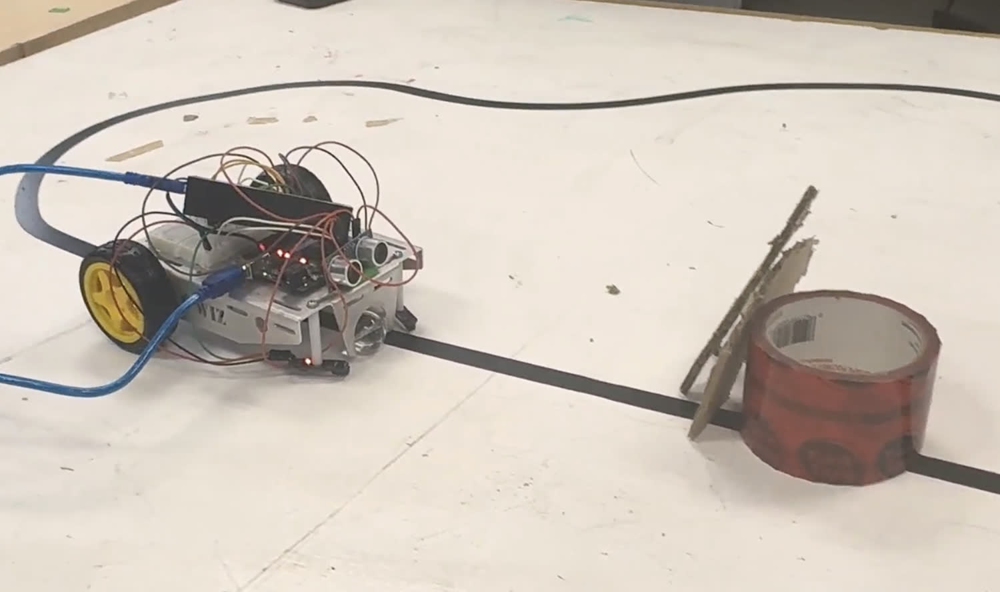

# Line-Following + Obstacle-Avoidance Robot

> Some robots follow instructions. Others follow a line and figure things out when something gets in the way.

A two-wheeled Arduino robot that tracks a black line with a pair of IR sensors, and — when an ultrasonic
sensor spots something in the path — leaves the line, drives around the obstacle, and hunts until it finds
the line again.



*Video: [`media/demo.mp4`](media/demo.mp4)*

---

## Why I built it

I wanted something that made a decision on its own. A line follower on its own is a reflex — sensor reads
dark, wheel slows down, done. Adding obstacle avoidance is what makes it interesting, because the robot has
to abandon the thing it was doing, execute a plan with no feedback while it's off the line, and then
successfully *find its way back*. That last part is the whole project. Driving around a box is easy.
Ending up back on the line afterwards is not.

It's also the most direct version of the thing I actually care about: code that moves something physical,
where being wrong means the robot drives into a wall instead of throwing an exception.

## How it works

**Line following** — two IR sensors sit underneath, one either side of the line.

| Left | Right | Meaning | Action |
|---|---|---|---|
| on | on | dead centre | both wheels at cruise |
| on | off | drifting right | slow the left wheel |
| off | on | drifting left | slow the right wheel |
| off | off | gap or lost | creep forward and keep looking |

That last row matters more than it looks. My first version stopped dead when both sensors went dark, which
meant every small gap in the tape ended the run. Creeping forward instead turns a gap into a non-event.

**Obstacle avoidance** — an HC-SR04 pings every loop. Inside `OBSTACLE_CM`, the robot runs a fixed routine:
stop, reverse, pivot off the line, drive alongside the obstacle, pivot back, cross over, then `findLine()`
crawls forward until a sensor picks the line back up. There's a timeout on the search so a genuinely lost
robot stops instead of exploring the room.

## Hardware

| Part | Notes |
|---|---|
| Arduino Uno | |
| L298N dual H-bridge | drives both motors |
| 2 × IR line sensors | mounted underneath, either side of the line |
| HC-SR04 ultrasonic | front-facing |
| 2 × DC gear motors + wheels | |
| Caster wheel | third contact point |
| Battery pack | separate supply for the motors |

## Wiring

See [`docs/wiring.md`](docs/wiring.md) for the full pin map.

## Build and flash

```bash
arduino-cli compile --fqbn arduino:avr:uno src/line_following_robot
```

```bash
arduino-cli upload -p /dev/ttyACM0 --fqbn arduino:avr:uno src/line_following_robot
```

Or just open `src/line_following_robot/line_following_robot.ino` in the Arduino IDE and hit upload.

## What went wrong

**Tuning it so it followed smoothly without drifting off.** This took the most iterations by a wide margin.
Small timing changes in the code visibly changed how the robot moved — a correction speed that's slightly
too aggressive turns smooth tracking into a wobble, and one that's too gentle lets it drift off a curve
entirely. The values in the tuning block are where I landed, and they're specific to my chassis.

**Making the obstacle-avoidance routine reliable.** The robot had to detect the obstacle, move around it,
and *successfully find the line again* — and that last step failed constantly at first. Because the
avoidance routine is open-loop (it drives on timers, not feedback), every turn duration had to be right
for the geometry of my chassis. Testing and adjusting the sensor readings and timing values took several
iterations before it worked consistently.

## What I'd do differently

- **Close the loop on the avoidance routine.** It currently drives on fixed timers, which means it only
  works for obstacles roughly the size I tested with. Using the ultrasonic sensor to track the obstacle's
  edge while driving past it would generalise far better.
- **PID instead of three-state correction.** The current logic has exactly three responses. A proportional
  controller on the sensor difference would give smooth, speed-proportional steering.
- **Analog IR sensors instead of digital.** Digital sensors give you on/off; analog would give a gradient,
  which is what a PID loop actually wants.

## A note on this code

I built this robot and it works — the video is real. The original sketch was lost when I reorganised my
files, so this is a reconstruction of the working build: same sensor logic, same structure, same tuned
behaviour. Every value in the tuning block is exposed as a named constant because that's how I actually
worked on it, changing one number at a time and rerunning it.

## Repo layout

```
src/line_following_robot/   the sketch
docs/wiring.md              pin map and wiring notes
media/                      photo and demo video
```

## License

MIT — see [LICENSE](LICENSE).
